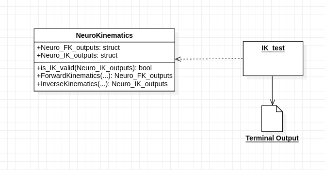

# Motion Planning for NeuroRobot

## Overview
This is the final project for the course, "RBE 580 - Biomedical Robotics" at WPI. In this project, the main goal was to develop a motion planning algorithm for a neuro surgical robot built at AIM Lab, WPI. The detailed report can be found in the "Report" folder. 

For a quick reference, here's a brief of all that was explored and implemented from scratch:
- [Slicer3D] Segmentation of brain MRI images to detect the tumor and white matter containing sensitivie nerves.
- [VTK/C++] For collision detection and generating collision-free entry points on the brain surface
- [C++] Robot Kinematics to validate if the entry points are reachable by the robot

---
## Class Diagram for Robot Kinematics 
<figure>
    
</figure>
 

---
## System Integration
<figure>
    
</figure>

